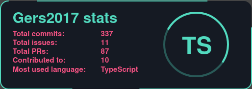
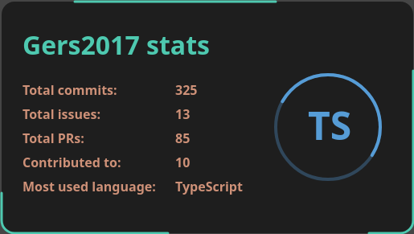
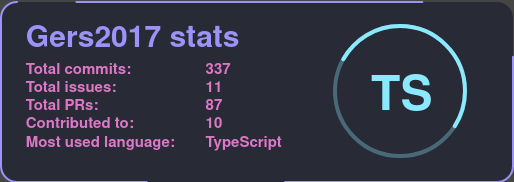
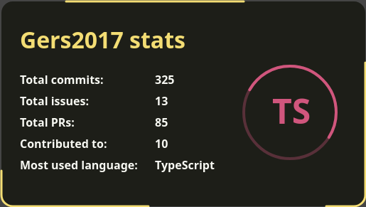

# Gers2017 Readme

Visualize your GitHub stats on your readme 🐙 

## Github card

Copy and paste the following into your readme and replace

```

```

### Username

Your GitHub username

### Cache_seconds (optional)

A number from 1800s to 86400s (30 minutes to one day). By default, 30 minutes

### Theme

List of available themes:

- ### Glitch
  
- ### Vscode
  
- ### Dracula
  
- ### Spectrum
  

Additionally, a preview of the themes can be found [here](!https://gers2017-readme.vercel.app/)
