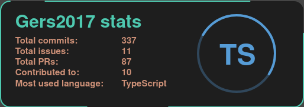

<div style="text-align: center;">
  <h1>Gers2017 Readme</h1>
  
  <h3>Visualize your GitHub stats from everywhere 🐙</h3>
  <h6>Powered by SVG and Next.js</h6>
</div>

 

## Github card

Copy and paste the following into your readme and replace

```

```

`username:` Your GitHub username

`cache_seconds (optional)`: The number of seconds to cache the response, from 1800s to 86400s (30 minutes to one day). By default, 30 minutes

`theme:` The name of the theme to use. If no theme is supplied the theme would be `glitch`

List of available themes:

- ### Glitch
  
- ### Vscode
  
- ### Dracula
  
- ### Spectrum
  

Additionally, a preview of the themes can be found [here](https://gers2017-readme.vercel.app/)
